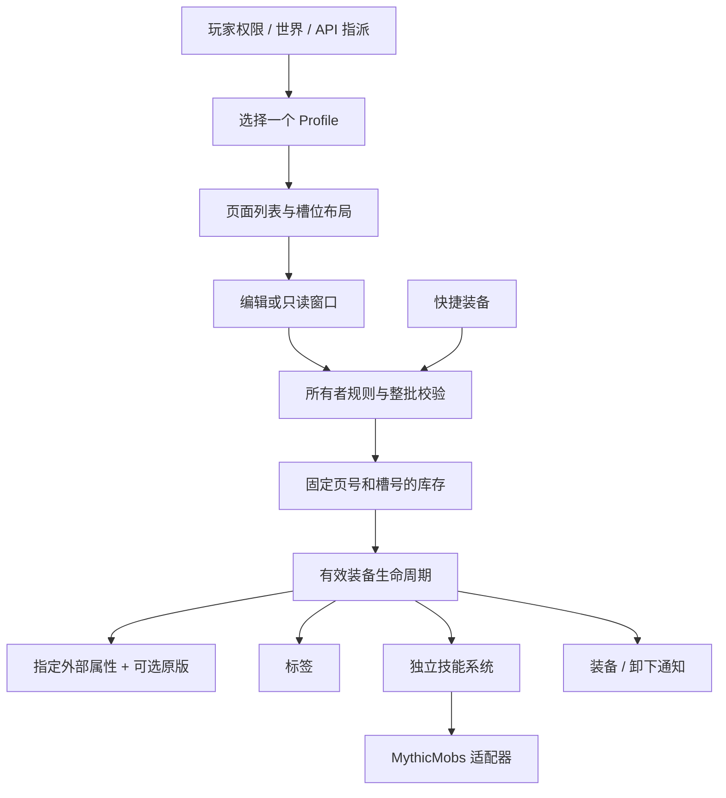

# 职责与生命周期

| 位置 | 单一职责 |
| --- | --- |
| Accessory | 插件入口与服务访问 |
| runtime/AccessoryRuntime | 组装服务、验证重载、关闭资源 |
| config | 解析主配置和布局值；不操作玩家或装备 |
| api | 对外接口、枚举和不可变数据；没有业务实现 |
| module/inventory/profile | 群体匹配、背包定义、会话覆盖和封禁 |
| module/inventory/ui | 窗口身份、异步打开、快照、按钮与提交 |
| module/inventory/InventoryRules | 手动操作和快捷装备共用的所有者规则与批量数量校验 |
| module/inventory/service | 对外库存控制的实现和主手物品转移 |
| module/inventory/AccessoryStore | 会话缓存、串行 I/O、失败写入保留、存储格式迁移 |
| module/lifecycle | 有效装备筛选、属性/标签/技能的恢复清理、状态差异事件 |
| module/attribute/load | 统一加载器接口、共享模板、四个具体来源 |
| module/attribute/parse | 原版 Lore 数值解析 |
| module/skill | 技能定义、识别、冷却、加载状态、触发分发和系统生命周期 |
| hook/myhic/skills | MythicMobs 施法与外部技能事件适配 |
| hook/aura | AuraSkills 自定义特性注册 |
| runtime/DebugLog | 分类、懒构造、节流和统一错误日志 |

AttributeLoader 仅负责用有效物品重建某个来源。AbstractAttributeLoader 每次刷新创建独立上下文，通过 begin/apply/finish 组织加载；不存在共享 currentPlayer 字段，不承担配置读取、库存写入、标签、技能或事件。AccessoryAttributes 只协调一个外部来源与独立的原版开关。

InventoryRule 校验背包所有者，操作者仅作为事件上下文。拖拽先合并全部候选槽位再校验。每个所有者最多一个窗口；异步打开同时验证所有者与查看者令牌。关闭提交使用窗口记录的页面和布局，固定存储位置不受 Profile 尺寸变化影响。READ_ONLY 窗口永不提交。

登录读取完成后恢复装备；重生、重载与 Profile 变化也走同一路径。退出清理效果后按存储模式保存或释放；死亡根据策略保留或掉落，再卸载效果。有效装备差异统一产生事件，重复刷新不会重复通知同一装备状态。

SkillSystem 自行拥有 MythicMobs 依赖监听、Bukkit/Mythic 触发监听、定时任务和 PlaceholderAPI 扩展。SkillEngine 只接收生命周期筛选后的有效物品；SkillCatalog 校验配置，SkillItems 识别物品，SkillCooldowns 管理冷却和施法重入，SkillBackend 隔离外部 API。没有依赖时不加载具体适配器。

存储读错误通过 Future 传播，不写正常空缓存；退出不允许从不存在的缓存生成空保存。失败写入快照保留至成功持久化，退出后也可重试。会话代数拒绝晚到加载回填，串行队列约束重连读写；关闭使用队列屏障。格式 2 保留隐藏槽位，旧格式只进行物品位置迁移，不兼容旧配置/API。

验证入口是 `gradle check` 和 `tests/lifecycle-probes/run.ps1`。前者验证配置、属性加载模板、事件、Profile、稳定槽位和技能冷却，后者对真实生产存储代码注入 SQL/文件故障。没有将这些模拟等同于真实 Paper/MySQL/第三方插件联调。
